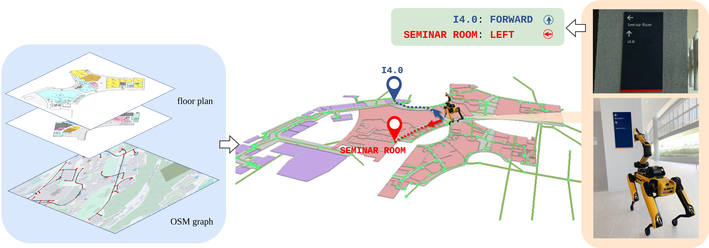

# SignLoc: Robust Localization using Navigation Signs and Public Maps

This repository contains the implementation of the following [publication](https://arxiv.org/pdf/2508.18606):
```bibtex
@misc{zimmerman2025arxiv,
      title={SignLoc: Robust Localization using Navigation Signs and Public Map}, 
      author={Nicky Zimmerman and Joel Loo and Ayush Agrawal and David Hsu},
      year={2025},
      eprint={2508.18606},
      archivePrefix={arXiv},
      primaryClass={cs.RO},
      url={https://arxiv.org/abs/2508.18606}, 
    }
```
## Results
Our live demo for both localization on the Spot platform can seen in the following video:
[](https://www.youtube.com/watch?v=EgpQHuaMOrc "SIGNLOC")


## Abstract
Navigation signs and maps, such as floor plans and street maps, are widely available and serve as ubiquitous aids for way-finding in human environments. Yet, they are rarely used by robot systems. This paper presents SignLoc, a global localization method that leverages navigation signs to localize the robot on publicly available maps—specifically floor plans and OpenStreetMap (OSM) graphs–without prior sensor-based mapping. SignLoc first extracts a navigation graph from the input map. It then employs a probabilistic observation model to match directional and locational cues from the detected signs to the graph, enabling robust topo-semantic localization within a Monte Carlo framework. We evaluated SignLoc in diverse large-scale environments: part of a university campus, a shopping mall, and a hospital complex. Experimental results show that SignLoc reliably localizes the robot after observing only one to two signs.



## Code is coming soon!
